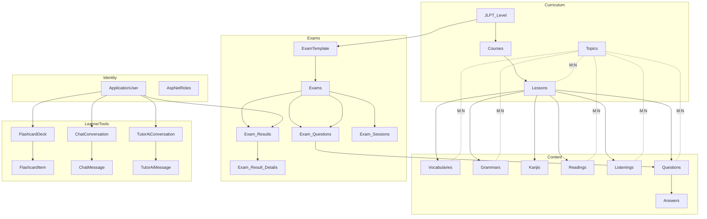
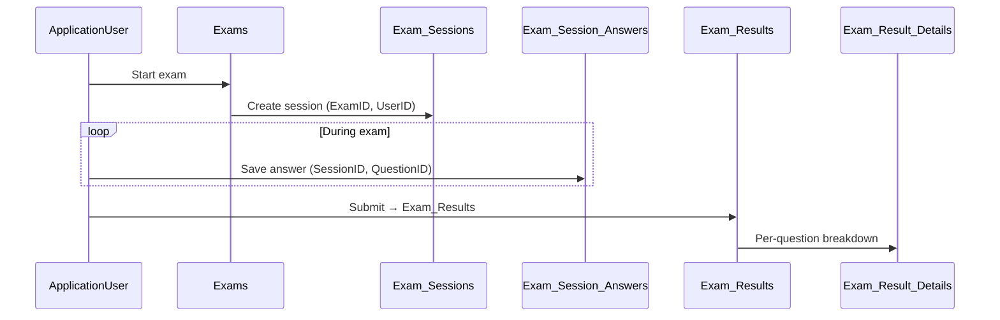

# Database ERD — QuizzTiengNhat (Entity Framework Core)

> Generated from `ApplicationDbContext`, entity models under `BE/Models/`, and `ApplicationDbContextModelSnapshot` (PostgreSQL, EF Core 9.0.12).

---

## 1. Entity Relationship Diagram (overview)

```
┌─────────────────────────────────────────────────────────────────────────────────┐
│                           IDENTITY (ASP.NET CORE)                                │
├─────────────────────────────────────────────────────────────────────────────────┤
│  AspNetRoles ◄── AspNetUserRoles ──► AspNetUsers (ApplicationUser)              │
│       ▲              │                    │                                      │
│       └── AspNetRoleClaims                ├── AspNetUserClaims / Logins / Tokens │
│                                           ├── LevelID ──► JLPT_Levels           │
│                                           ├── Progresses, Exam_Results, ...     │
└─────────────────────────────────────────────────────────────────────────────────┘

┌─────────────────────────────────────────────────────────────────────────────────┐
│                         CURRICULUM & CONTENT HIERARCHY                           │
├─────────────────────────────────────────────────────────────────────────────────┤
│  JLPT_Levels ──1:N──► Courses ──1:N──► Lessons                                   │
│       │                    │              │                                        │
│       ├── Vocabularies, Grammars, Kanjis, Questions (via Lesson + Level)         │
│       ├── ExamTemplates ──1:N──► ExamTemplateDetails                              │
│       └── ExamTemplates / Users / ...                                            │
│                                                                                  │
│  Topics ◄──M:N──► Lessons | Questions | Vocab | Grammar | Reading | Listening   │
│              (junction: Lessons_Topic, Questions_Topic, VocabTopics, ...)       │
└─────────────────────────────────────────────────────────────────────────────────┘

┌─────────────────────────────────────────────────────────────────────────────────┐
│                              EXAM & ASSESSMENT                                     │
├─────────────────────────────────────────────────────────────────────────────────┤
│  Exams ──1:N──► Exam_Questions ──► Question | Reading | Listening               │
│    │              │                                                              │
│    ├── Exam_Results ──1:N──► Exam_Result_Details                                │
│    └── Exam_Sessions ──1:N──► Exam_Session_Answers                              │
└─────────────────────────────────────────────────────────────────────────────────┘

┌─────────────────────────────────────────────────────────────────────────────────┐
│                    LEARNER TOOLS (Flashcard, Chat, Tutor AI)                     │
├─────────────────────────────────────────────────────────────────────────────────┤
│  FlashcardDecks ──1:N──► FlashcardItems                                         │
│  ChatConversations ──1:N──► ChatMessages                                         │
│  TutorAiConversations ──1:N──► TutorAiMessages ──1:1──► TutorAiMessageAudios    │
│  UserAnswerHistories | UserInterests | User_Skill_Matrices                       │
└─────────────────────────────────────────────────────────────────────────────────┘
```

---

## 2. DbContext summary

**Class:** `ApplicationDbContext` : `IdentityDbContext<ApplicationUser>`

| # | DbSet property | Table name | Entity |
|---|----------------|------------|--------|
| 1 | `JLPT_Levels` | JLPT_Levels | JLPT_Level |
| 2 | `Courses` | Courses | Courses |
| 3 | `Topics` | Topics | Topics |
| 4 | `Lessons` | Lessons | Lessons |
| 5 | `Radicals` | Radicals | Radicals |
| 6 | `RadicalVariants` | RadicalVariants | RadicalVariants |
| 7 | `WordTypes` | WordTypes | WordTypes |
| 8 | `GrammarGroups` | GrammarGroups | GrammarGroups |
| 9 | `Vocabularies` | Vocabularies | Vocabularies |
| 10 | `Grammars` | Grammars | Grammars |
| 11 | `Kanjis` | Kanjis | Kanjis |
| 12 | `Listenings` | Listenings | Listenings |
| 13 | `Readings` | Readings | Readings |
| 14 | `Examples` | Examples | Examples |
| 15 | `Questions` | Questions | Questions |
| 16 | `Answers` | Answers | Answers |
| 17 | `Progresses` | Progresses | Progress |
| 18 | `Exam_Results` | Exam_Results | Exam_Results |
| 19 | `Lessons_Topics` | Lessons_Topics | Lessons_Topic |
| 20 | `Questions_Topics` | Questions_Topics | Questions_Topic |
| 21 | `VocabularyKanjis` | VocabularyKanjis | VocabularyKanjis |
| 22 | `VocabWordTypes` | VocabWordTypes | VocabWordTypes |
| 23 | `VocabTopics` | VocabTopics | VocabTopics |
| 24 | `GrammarTopics` | GrammarTopics | GrammarTopics |
| 25 | `ReadingTopics` | ReadingTopics | ReadingTopics |
| 26 | `ListeningTopics` | ListeningTopics | ListeningTopics |
| 27 | `ExamTemplates` | ExamTemplates | ExamTemplate |
| 28 | `ExamTemplateDetails` | ExamTemplateDetails | ExamTemplateDetail |
| 29 | `Exams` | Exams | Exams |
| 30 | `Exam_Questions` | Exam_Questions | Exam_Questions |
| 31 | `Exam_Result_Details` | Exam_Result_Details | Exam_Result_Details |
| 32 | `User_Skill_Matrices` | User_Skill_Matrices | User_Skill_Matrix |
| 33 | `Exam_Sessions` | Exam_Sessions | Exam_Sessions |
| 34 | `Exam_Session_Answers` | Exam_Session_Answers | Exam_Session_Answers |
| 35 | `FlashcardDecks` | FlashcardDecks | FlashcardDeck |
| 36 | `FlashcardItems` | FlashcardItems | FlashcardItem |
| 37 | `UserAnswerHistories` | UserAnswerHistories | UserAnswerHistory |
| 38 | `UserInterests` | UserInterests | UserInterest |
| 39 | `ChatConversations` | ChatConversations | ChatConversation |
| 40 | `ChatMessages` | ChatMessages | ChatMessage |
| 41 | `ChatRoundRobinStates` | ChatRoundRobinStates | ChatRoundRobinState |
| 42 | `TutorAiConversations` | TutorAiConversations | TutorAiConversation |
| 43 | `TutorAiMessages` | TutorAiMessages | TutorAiMessage |
| 44 | `TutorAiMessageAudios` | TutorAiMessageAudios | TutorAiMessageAudio |

**Identity tables** (inherited): `AspNetRoles`, `AspNetRoleClaims`, `AspNetUserClaims`, `AspNetUserLogins`, `AspNetUserRoles`, `AspNetUserTokens`, `AspNetUsers`.

### Fluent API highlights (`OnModelCreating`)

| Configuration | Entities |
|---------------|----------|
| Composite PK | `Lessons_Topic`, `Questions_Topic`, `VocabularyKanjis`, `VocabWordTypes`, `VocabTopics`, `GrammarTopics`, `ReadingTopics`, `ListeningTopics`, `UserInterest` |
| Cascade delete | `TutorAiMessage` → `Conversation`; `TutorAiMessageAudio` → `Message`; `FlashcardItem` → `Deck`; `Exam_Result_Details` → `Result` |
| Restrict delete | `Questions.ParentID` (self-ref); junction tables involving `Lessons` / `Topics`; `Exam_Result_Details` → `Question` |
| Global override | Cascade on `Lessons`, `JLPT_Level`, `Topics` as principal → changed to **Restrict** |
| Unique index | `User_Skill_Matrix (UserID, SkillType)`; `TutorAiMessage (ConversationId, ClientMessageId)`; `FlashcardDeck (UserID, DeckSyncKey)` filtered |

---

## 3. Relationship list

Legend: **PK** = primary key, **FK** = foreign key, **M:N** = many-to-many via junction.

### 3.1 Identity

| From | To | Cardinality | FK column | Delete behavior | Notes |
|------|-----|-------------|-----------|-----------------|-------|
| AspNetUserClaims | ApplicationUser | N:1 | UserId | Cascade | |
| AspNetUserLogins | ApplicationUser | N:1 | UserId | Cascade | |
| AspNetUserRoles | ApplicationUser | N:1 | UserId | Cascade | |
| AspNetUserRoles | AspNetRoles | N:1 | RoleId | Cascade | |
| AspNetUserTokens | ApplicationUser | N:1 | UserId | Cascade | |
| AspNetRoleClaims | AspNetRoles | N:1 | RoleId | Cascade | |
| ApplicationUser | JLPT_Level | N:1 | LevelID | SetNull | Configured in Fluent API (`u.Level`) |
| ApplicationUser | JLPT_Level | N:1 | JLPT_LevelLevelID | ClientSetNull | **Shadow FK** from `JLPT_Level.Users` collection |

### 3.2 Curriculum

| From | To | Cardinality | FK column | Delete behavior | Notes |
|------|-----|-------------|-----------|-----------------|-------|
| Courses | JLPT_Level | N:1 | LevelID | Cascade | Required |
| Lessons | Courses | N:1 | CourseID | Restrict | Required |
| Lessons | JLPT_Level | N:1 | JLPT_LevelLevelID | — | **Shadow FK** (no `LevelID` on model) |

### 3.3 Topics (M:N junctions)

| Junction table | PK | FK → A | FK → B | Delete A / B |
|----------------|-----|--------|--------|--------------|
| Lessons_Topic | (LessonsID, TopicID) | Lessons | Topics | Restrict / Restrict |
| Questions_Topic | (QuestionID, TopicID) | Questions | Topics | Cascade / Cascade |
| VocabTopics | (VocabID, TopicID) | Vocabularies | Topics | Restrict / Restrict |
| GrammarTopics | (GrammarID, TopicID) | Grammars | Topics | Restrict / Restrict |
| ReadingTopics | (ReadingID, TopicID) | Readings | Topics | Restrict / Restrict |
| ListeningTopics | (ListeningID, TopicID) | Listenings | Topics | Restrict / Restrict |
| UserInterests | (UserID, TopicID) | ApplicationUser | Topics | Cascade / Cascade |

### 3.4 Learning content

| From | To | Cardinality | FK column | Delete behavior |
|------|-----|-------------|-----------|-----------------|
| Vocabularies | JLPT_Level | N:1 | LevelID | Cascade |
| Vocabularies | Lessons | N:1 | LessonID | Cascade |
| Grammars | JLPT_Level | N:1 | LevelID | Cascade |
| Grammars | Lessons | N:1 | LessonID | Cascade |
| Grammars | GrammarGroups | N:1 | GrammarGroupID | SetNull |
| Kanjis | JLPT_Level | N:1 | LevelID | Cascade |
| Kanjis | Lessons | N:1 | LessonID | Cascade |
| Kanjis | Topics | N:1 | TopicID | Cascade |
| Kanjis | Radicals | N:1 | RadicalID | SetNull |
| Listenings | JLPT_Level | N:1 | LevelID | Cascade |
| Listenings | Lessons | N:1 | LessonID | Cascade |
| Readings | JLPT_Level | N:1 | LevelID | Cascade |
| Readings | Lessons | N:1 | LessonID | Cascade |
| RadicalVariants | Radicals | N:1 | RadicalID | Cascade |
| Examples | Vocabularies | N:1 | VocabID | Optional |
| Examples | Grammars | N:1 | GrammarID | Optional |
| VocabularyKanjis | Vocabularies + Kanjis | M:N | VocabID, KanjiID | Cascade both |
| VocabWordTypes | Vocabularies + WordTypes | M:N | VocabID, WordTypeID | Cascade both |

### 3.5 Questions & answers

| From | To | Cardinality | FK column | Delete behavior |
|------|-----|-------------|-----------|-----------------|
| Questions | Lessons | N:1 | LessonID | Cascade |
| Questions | JLPT_Level | N:1 | JLPT_LevelLevelID | — | Shadow FK |
| Questions | Readings | N:1 | ReadingID | Optional |
| Questions | Listenings | N:1 | ListeningID | Optional |
| Questions | Questions | N:1 self | ParentID | Restrict (parent/child) |
| Answers | Questions | N:1 | QuestionID | Cascade |

### 3.6 Exams & results

| From | To | Cardinality | FK column | Delete behavior |
|------|-----|-------------|-----------|-----------------|
| ExamTemplate | JLPT_Level | N:1 | LevelID | Cascade |
| ExamTemplateDetail | ExamTemplate | N:1 | TemplateID | Cascade |
| Exams | ExamTemplate | N:1 | TemplateID | SetNull |
| Exams | Courses | N:1 | CourseID | SetNull |
| Exams | Lessons | N:1 | LessonID | SetNull |
| Exams | JLPT_Level | N:1 | LevelID | Optional |
| Exam_Questions | Exams | N:1 | ExamID | Cascade |
| Exam_Questions | Questions | N:1 | QuestionID | Optional |
| Exam_Questions | Readings | N:1 | ReadingID | Optional |
| Exam_Questions | Listenings | N:1 | ListeningID | Optional |
| Exam_Results | Exams | N:1 | ExamID | Cascade |
| Exam_Results | ApplicationUser | N:1 | UserID | Cascade |
| Exam_Result_Details | Exam_Results | N:1 | ResultID | Cascade |
| Exam_Result_Details | Questions | N:1 | QuestionID | Restrict |
| Exam_Result_Details | Topics | N:1 | TopicID | SetNull |
| Exam_Result_Details | Readings | N:1 | ReadingID | SetNull |
| Exam_Result_Details | Listenings | N:1 | ListeningID | SetNull |
| Exam_Result_Details | Exam_Questions | N:1 | ExamQuestionID | SetNull |
| Exam_Result_Details | Exams | N:1 | ExamsExamID | — | **Shadow FK** (navigation on Exams) |
| Exam_Sessions | Exams | N:1 | ExamID | Cascade |
| Exam_Session_Answers | Exam_Sessions | N:1 | SessionID | Cascade |

### 3.7 User progress & personalization

| From | To | Cardinality | FK column | Delete behavior | Notes |
|------|-----|-------------|-----------|-----------------|-------|
| Progress | ApplicationUser | N:1 | UserID | Cascade | |
| Progress | Lessons | N:1 | LessonsID | Cascade | |
| Progress | JLPT_Level | — | LevelID | **No FK** | Column exists; not mapped as navigation |
| User_Skill_Matrix | ApplicationUser | N:1 | UserID | Cascade | Unique (UserID, SkillType) |
| User_Skill_Matrix | JLPT_Level | N:1 | LevelID | SetNull | |
| UserAnswerHistory | ApplicationUser | N:1 | UserID | Cascade | |
| UserAnswerHistory | Questions | N:1 | QuestionID | Cascade | |
| UserAnswerHistory | Answers | — | SelectedAnswerID | **No FK** | Nullable column only |

### 3.8 Flashcards

| From | To | Cardinality | FK column | Delete behavior |
|------|-----|-------------|-----------|-----------------|
| FlashcardDeck | ApplicationUser | N:1 | UserID | Cascade |
| FlashcardDeck | JLPT_Level | N:1 | LevelID | SetNull |
| FlashcardItem | FlashcardDeck | N:1 | DeckID | Cascade |

### 3.9 Chat & Tutor AI

| From | To | Cardinality | FK column | Delete behavior | Notes |
|------|-----|-------------|-----------|-----------------|-------|
| ChatConversation | ApplicationUser (Learner) | N:1 | LearnerId | Cascade | |
| ChatConversation | ApplicationUser (Admin) | N:1 | AssignedAdminId | Cascade | |
| ChatMessage | ChatConversation | N:1 | ConversationId | Cascade | |
| ChatMessage | ApplicationUser (Sender) | N:1 | SenderId | Cascade | |
| TutorAiMessage | TutorAiConversation | N:1 | ConversationId | Cascade | |
| TutorAiMessageAudio | TutorAiMessage | 1:1 | MessageId | Cascade | |
| TutorAiConversation | ApplicationUser | — | UserId | **No FK** | Indexed only |
| ChatRoundRobinState | — | — | — | Standalone singleton (Id = 1) | |

### 3.10 Columns without EF relationships

| Table | Column | Intended reference |
|-------|--------|-------------------|
| Exam_Sessions | UserID | ApplicationUser (not configured) |
| Exam_Session_Answers | QuestionID, SelectedAnswerID | Questions / Answers (not configured) |
| FlashcardItem | EntityID | Polymorphic ref to Vocab/Grammar/Kanji/etc. (no FK) |

---

## 4. Mermaid diagrams

### 4.1 High-level domain map



### 4.2 Full ER diagram (core entities)

```mermaid
erDiagram
    JLPT_Level ||--o{ Courses : "LevelID"
    JLPT_Level ||--o{ ExamTemplate : "LevelID"
    JLPT_Level ||--o{ Vocabularies : "LevelID"
    JLPT_Level ||--o{ Grammars : "LevelID"
    JLPT_Level ||--o{ Kanjis : "LevelID"
    JLPT_Level ||--o{ Listenings : "LevelID"
    JLPT_Level ||--o{ Readings : "LevelID"
    JLPT_Level |o--o{ ApplicationUser : "LevelID"

    Courses ||--o{ Lessons : "CourseID"
    Lessons ||--o{ Questions : "LessonID"
    Lessons ||--o{ Vocabularies : "LessonID"
    Lessons ||--o{ Grammars : "LessonID"
    Lessons ||--o{ Kanjis : "LessonID"
    Lessons ||--o{ Listenings : "LessonID"
    Lessons ||--o{ Readings : "LessonID"
    Lessons ||--o{ Progress : "LessonsID"

    Topics ||--o{ Lessons_Topic : ""
    Lessons ||--o{ Lessons_Topic : ""
    Topics ||--o{ Questions_Topic : ""
    Questions ||--o{ Questions_Topic : ""
    Topics ||--o{ VocabTopics : ""
    Vocabularies ||--o{ VocabTopics : ""
    Topics ||--o{ GrammarTopics : ""
    Grammars ||--o{ GrammarTopics : ""
    Topics ||--o{ ReadingTopics : ""
    Readings ||--o{ ReadingTopics : ""
    Topics ||--o{ ListeningTopics : ""
    Listenings ||--o{ ListeningTopics : ""

    Radicals ||--o{ RadicalVariants : "RadicalID"
    Radicals ||--o{ Kanjis : "RadicalID"
    GrammarGroups ||--o{ Grammars : "GrammarGroupID"

    Vocabularies ||--o{ VocabularyKanjis : ""
    Kanjis ||--o{ VocabularyKanjis : ""
    Vocabularies ||--o{ VocabWordTypes : ""
    WordTypes ||--o{ VocabWordTypes : ""

    Vocabularies ||--o{ Examples : "VocabID"
    Grammars ||--o{ Examples : "GrammarID"

    Readings ||--o{ Questions : "ReadingID"
    Listenings ||--o{ Questions : "ListeningID"
    Questions ||--o{ Answers : "QuestionID"
    Questions ||--o{ Questions : "ParentID"

    ExamTemplate ||--o{ ExamTemplateDetail : "TemplateID"
    ExamTemplate ||--o{ Exams : "TemplateID"
    Courses ||--o{ Exams : "CourseID"
    Lessons ||--o{ Exams : "LessonID"
    JLPT_Level ||--o{ Exams : "LevelID"

    Exams ||--o{ Exam_Questions : "ExamID"
    Questions ||--o{ Exam_Questions : "QuestionID"
    Readings ||--o{ Exam_Questions : "ReadingID"
    Listenings ||--o{ Exam_Questions : "ListeningID"

    Exams ||--o{ Exam_Results : "ExamID"
    ApplicationUser ||--o{ Exam_Results : "UserID"
    Exam_Results ||--o{ Exam_Result_Details : "ResultID"
    Questions ||--o{ Exam_Result_Details : "QuestionID"
    Topics ||--o{ Exam_Result_Details : "TopicID"
    Readings ||--o{ Exam_Result_Details : "ReadingID"
    Listenings ||--o{ Exam_Result_Details : "ListeningID"
    Exam_Questions ||--o{ Exam_Result_Details : "ExamQuestionID"

    Exams ||--o{ Exam_Sessions : "ExamID"
    Exam_Sessions ||--o{ Exam_Session_Answers : "SessionID"

    ApplicationUser ||--o{ Progress : "UserID"
    ApplicationUser ||--o{ User_Skill_Matrix : "UserID"
    JLPT_Level ||--o{ User_Skill_Matrix : "LevelID"
    ApplicationUser ||--o{ UserAnswerHistory : "UserID"
    Questions ||--o{ UserAnswerHistory : "QuestionID"
    ApplicationUser ||--o{ UserInterest : "UserID"
    Topics ||--o{ UserInterest : "TopicID"

    ApplicationUser ||--o{ FlashcardDeck : "UserID"
    JLPT_Level ||--o{ FlashcardDeck : "LevelID"
    FlashcardDeck ||--o{ FlashcardItem : "DeckID"

    ApplicationUser ||--o{ ChatConversation : "LearnerId"
    ApplicationUser ||--o{ ChatConversation : "AssignedAdminId"
    ChatConversation ||--o{ ChatMessage : "ConversationId"
    ApplicationUser ||--o{ ChatMessage : "SenderId"

    TutorAiConversation ||--o{ TutorAiMessage : "ConversationId"
    TutorAiMessage ||--|| TutorAiMessageAudio : "MessageId"

    JLPT_Level {
        uuid LevelID PK
        string LevelName
    }
    Courses {
        uuid CourseID PK
        uuid LevelID FK
        string CourseName
    }
    Lessons {
        uuid LessonID PK
        uuid CourseID FK
        string Title
        int SortOrder
    }
    Topics {
        uuid TopicID PK
        string TopicName
    }
    ApplicationUser {
        string Id PK
        string FullName
        uuid LevelID FK
    }
    Questions {
        uuid QuestionID PK
        uuid LessonID FK
        uuid ParentID FK
        uuid ReadingID FK
        uuid ListeningID FK
    }
    Exams {
        uuid ExamID PK
        uuid TemplateID FK
        uuid CourseID FK
        uuid LessonID FK
        uuid LevelID FK
    }
```



### 4.3 Exam flow (session taking)



### 4.4 Junction tables (M:N)

```mermaid
erDiagram
    Lessons_Topic {
        uuid LessonsID PK_FK
        uuid TopicID PK_FK
    }
    Questions_Topic {
        uuid QuestionID PK_FK
        uuid TopicID PK_FK
    }
    VocabTopics {
        uuid VocabID PK_FK
        uuid TopicID PK_FK
    }
    GrammarTopics {
        uuid GrammarID PK_FK
        uuid TopicID PK_FK
    }
    ReadingTopics {
        uuid ReadingID PK_FK
        uuid TopicID PK_FK
    }
    ListeningTopics {
        uuid ListeningID PK_FK
        uuid TopicID PK_FK
    }
    VocabularyKanjis {
        uuid VocabID PK_FK
        uuid KanjiID PK_FK
    }
    VocabWordTypes {
        uuid VocabID PK_FK
        uuid WordTypeID PK_FK
    }
    UserInterest {
        string UserID PK_FK
        uuid TopicID PK_FK
    }
```



---

## 5. Entity primary keys

| Entity | PK type | Key property |
|--------|---------|--------------|
| JLPT_Level | uuid | LevelID |
| Courses | uuid | CourseID |
| Lessons | uuid | LessonID |
| Topics | uuid | TopicID |
| Radicals | uuid | RadicalID |
| RadicalVariants | uuid | VariantID |
| WordTypes | uuid | WordTypeID |
| GrammarGroups | uuid | GrammarGroupID |
| Vocabularies | uuid | VocabID |
| Grammars | uuid | GrammarID |
| Kanjis | uuid | KanjiID |
| Listenings | uuid | ListeningID |
| Readings | uuid | ReadingID |
| Examples | uuid | ExampleID |
| Questions | uuid | QuestionID |
| Answers | uuid | AnswerID |
| Progress | uuid | ProgressID |
| ExamTemplate | uuid | TemplateID |
| ExamTemplateDetail | uuid | DetailID |
| Exams | uuid | ExamID |
| Exam_Questions | uuid | ExamQuestionID |
| Exam_Results | uuid | ResultID |
| Exam_Result_Details | uuid | ResultDetailID |
| Exam_Sessions | uuid | SessionID |
| Exam_Session_Answers | uuid | SessionAnswerID |
| User_Skill_Matrix | uuid | MatrixID |
| FlashcardDeck | uuid | DeckID |
| FlashcardItem | uuid | ItemID |
| UserAnswerHistory | uuid | HistoryID |
| ChatConversation | uuid | Id |
| ChatMessage | uuid | Id |
| ChatRoundRobinState | int | Id (singleton) |
| TutorAiConversation | int | Id |
| TutorAiMessage | int | Id |
| TutorAiMessageAudio | int | Id |
| ApplicationUser | string | Id (Identity) |
| All junction tables | composite | see §3.3 |

---

## 6. Model hygiene notes

These items come from comparing **C# models** with the **EF snapshot** and may affect migrations or queries:

1. **Duplicate JLPT links on `ApplicationUser`:** `LevelID` (explicit) and shadow `JLPT_LevelLevelID` (from `JLPT_Level.Users`). Prefer a single FK.
2. **Shadow `JLPT_LevelLevelID` on `Lessons` and `Questions`:** `JLPT_Level` exposes collections without matching FK properties on child entities.
3. **Shadow `ExamsExamID` on `Exam_Result_Details`:** Extra link to `Exams` besides `ResultID` → `Exam_Results` → `Exams`.
4. **`Progress.LevelID`:** Stored but not configured as a relationship to `JLPT_Level`.
5. **`Exam_Sessions.UserID`:** No FK to `ApplicationUser`.
6. **`Exam_Session_Answers`:** `QuestionID` / `SelectedAnswerID` not wired to `Questions` / `Answers`.
7. **`TutorAiConversation.UserId`:** String user id with index only; no navigation to `ApplicationUser`.
8. **`ChatRoundRobinState`:** No relationships; single-row config table.

---

## 7. How to regenerate

After model changes:

```bash
cd BE
dotnet ef migrations add <MigrationName>
dotnet ef database update
```

Re-run this analysis from `ApplicationDbContext.cs`, `BE/Models/*.cs`, and `Migrations/ApplicationDbContextModelSnapshot.cs`.
